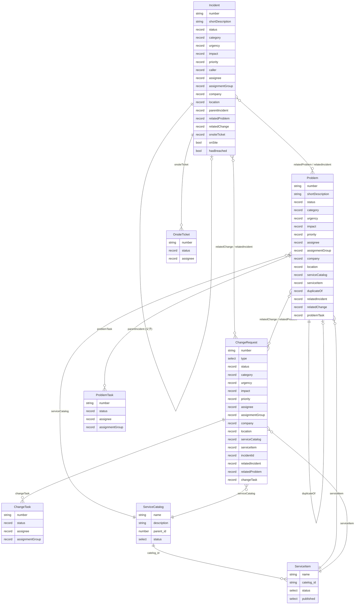
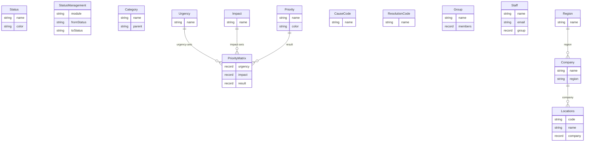
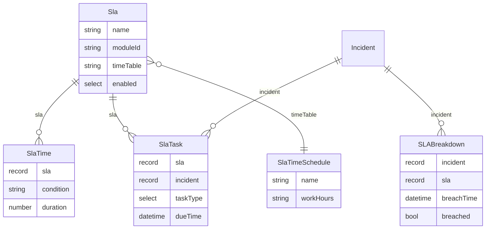

## 概述

本文描述 `lowcode-mx` 仓库 ITSM 命名空间（namespaceID: `409824987081211905`）的数据模型，涵盖核心业务实体、参照数据实体及其关联关系。

---

## 模块分层

ITSM 命名空间的 47 个模块按职责分为四层：

| 层级 | 说明 | 典型模块 |
|------|------|---------|
| 核心工单层 | 业务驱动的主实体，全生命周期流转 | Incident、Problem、ChangeRequest、ServiceApplication |
| 子任务层 | 从属于核心工单的拆分任务或附属记录 | ChangeTask、ProblemTask、OnsiteTicket、IncidentComment |
| 服务目录层 | 定义服务结构与服务项 | ServiceCatalog、ServiceItem、ServiceSetting |
| 参照数据层 | 为核心工单提供受控值 | Status、StatusManagement、Category、Priority、Urgency、Impact、PriorityMatrix、CauseCode、ResolutionCode、Group、Company、Locations、Region、Staff、User |
| 知识与自动化层 | 辅助运营的独立模块 | KnowledgeBase、Sla、SLABreakdown、SlaTask、SlaTime、SlaTimeSchedule、Survey、AssignRule、OrderRule、Todo、TodoCalendar、topData、receiptHistory、InventoryUsage、PurchaseRequest |

---

## 核心实体关系图

---

## 参照数据关系图

---

## SLA 模型

---

## 知识辅助模块

| 模块 | 作用 | 关键字段 |
|------|------|---------|
| KnowledgeBase | 知识文章库 | title、content、category（Select）、IsPublished、status |
| Survey | 问卷定义 | 问卷结构字段 |
| AssignRule | 自动分单规则 | 条件表达式、目标 Group/Staff |
| OrderRule | 工单排序规则 | 字段权重配置 |
| Todo | 待办任务 | 关联记录、截止时间 |
| TodoCalendar | 待办日历视图 | 日历展示专用计算字段 |
| topData | 置顶功能数据 | useID、modID、pageID、recoID、topTime |
| receiptHistory | 电子签单历史 | 签单记录、工单引用 |
| InventoryUsage | 备件领用 | 物料、数量、关联工单 |
| PurchaseRequest | 采购申请 | 物料、供应商、数量 |

---

## 跨命名空间引用

| 字段 | 所在模块 | 目标命名空间 | 目标模块 |
|------|--------|------------|--------|
| faultyAssetIDs | Incident | `441734926586019841` | Asset (`442132253003874305`) |

跨命名空间字段为只读引用，不在本仓库维护。

---

## 模块 ID 速查表

| handle | name | moduleID |
|--------|------|----------|
| Incident | 事件管理 | `409824987082063873` |
| Problem | Problem | `420479851385192449` |
| ChangeRequest | ChangeRequest | `421350840436195329` |
| ChangeTask | ChangeTask | `421363471985147905` |
| ProblemTask | ProblemTask | `420505216471859201` |
| OnsiteTicket | OnsiteTicket | `412437053198827521` |
| ServiceCatalog | ServiceCatalog | `420682924451430401` |
| ServiceItem | ServiceItem | `420683625135079425` |
| Sla | Sla | `409824987082784769` |
| KnowledgeBase | KnowledgeBase | `409824987082391553` |
| Status | StatusManagement (状态值) | `409824987081605121` |
| StatusManagement | 状态流转配置 | `409824987081539585` |
| Category | Category | `409824987082457089` |
| Priority | Priority | `409824987082326017` |
| PriorityMatrix | PriorityMatrix | `409824987082915841` |
| Urgency | Urgency | `409824987082194945` |
| Impact | Impact | `409824987081670657` |
| CauseCode | CauseCode | `409824987082129409` |
| ResolutionCode | ResolutionCode | `409824987081801729` |
| Group | Group | `409824987082653697` |
| Staff | EmploymentApplication | `409824987082522625` |
| Company | Company | `409824987081998337` |
| Locations | Locations | `409824987082719233` |
| topData | topData | `470129866610507777` |
