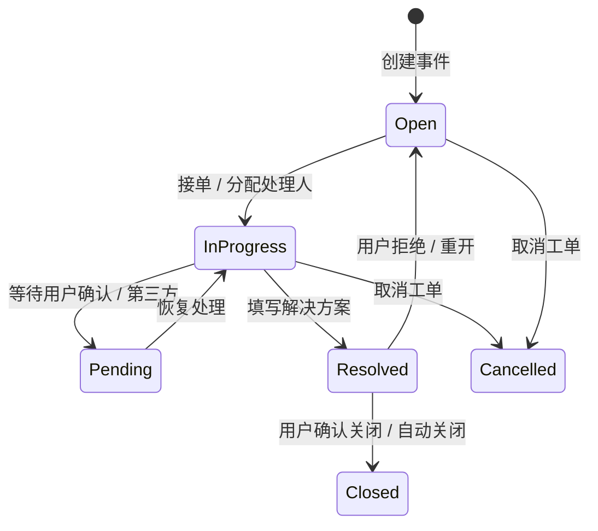
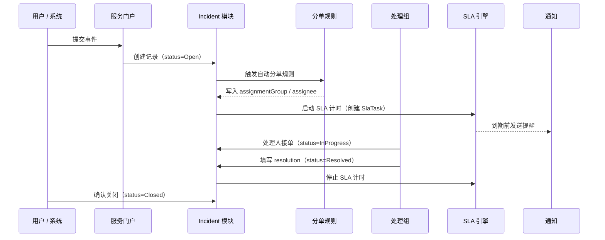
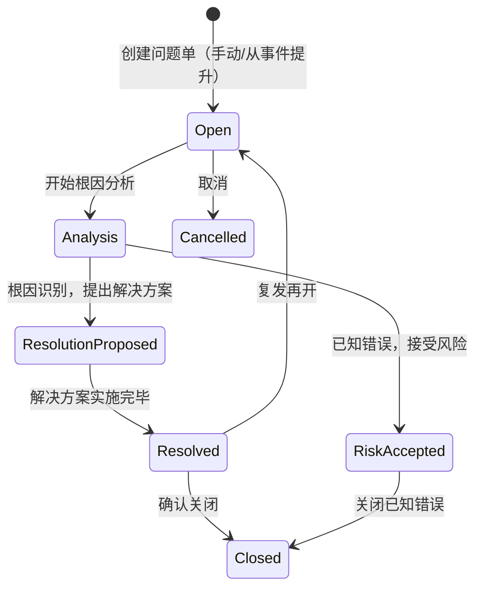
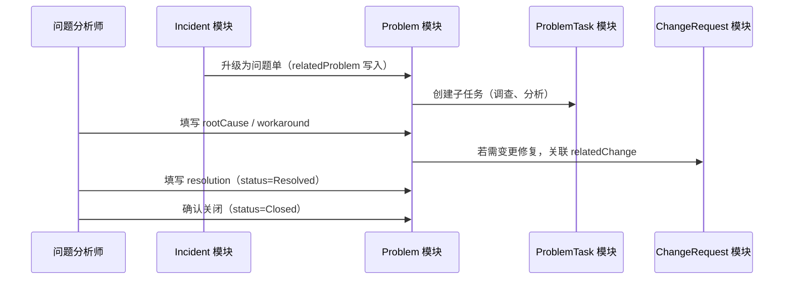
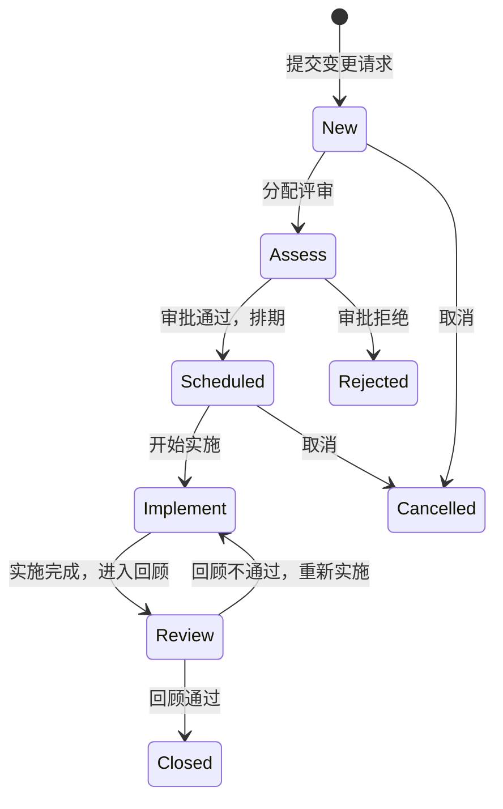
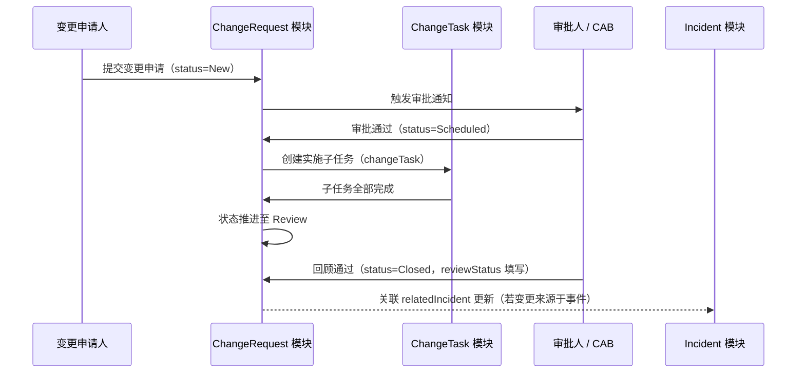
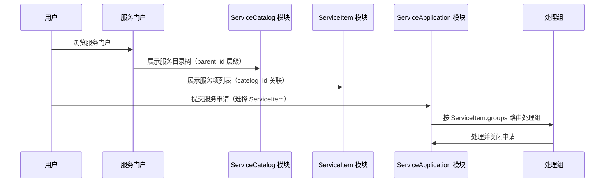
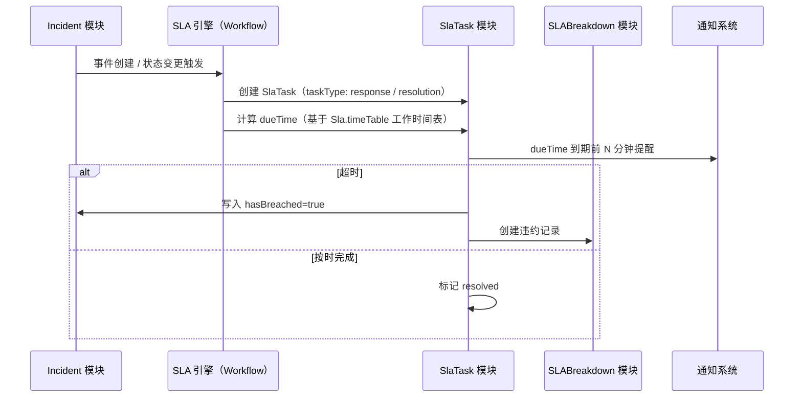

## 概述

本文描述 `lowcode-mx` ITSM 命名空间的四条核心业务流程：事件管理、问题管理、变更管理、服务请求。所有流程均通过 Corteza lowcode 平台的 Module（数据层）+ Workflow（自动化层）+ Page/Layout（展示层）协同实现。

---

## 事件管理流程

### 状态机

### 核心时序

### 关键业务规则

- `priority` 由 `urgency` × `impact` 经 PriorityMatrix 自动计算写入。
- `onSite=true` 时自动创建 OnsiteTicket 子工单并派遣现场工程师。
- `parentIncident` 支持父子工单层级，子工单状态不影响父工单独立流转。
- 事件关闭后 `hasBreached` 标记由 SLA 引擎写回；已违约的事件在报表中单独统计。
- 重开次数通过 workflow 计数，写入 `reopenCount`（若有）或日志模块。

---

## 问题管理流程

### 状态机

### 核心时序

### 关键业务规则

- `duplicateOf` 字段指向另一个 Problem，用于标记重复问题单合并处理。
- `workaroundApplied=true` 时可跳过解决方案直接进入 Resolved 状态。
- 已知错误（Known Error）通过 `status=RiskAccepted` 持久化存档，不强制关闭。
- Problem 与 Incident 为多对多双向关联（`relatedIncident` / `relatedProblem`）。

---

## 变更管理流程

### 变更类型与状态机

变更类型（`type` 字段，Select）：

| 值 | 说明 | 审批要求 |
|----|------|--------|
| Standard | 标准变更（预审批） | 自动审批 |
| Normal | 普通变更 | CAB 审批 |
| Emergency | 紧急变更 | 授权人紧急审批 |

### 核心时序

### 关键业务规则

- `changePlan`、`backoutPlan`、`riskAndImpactAnalysis`、`testPlan`、`implementationPlan` 均为必填文档字段，审批前需填写。
- 紧急变更（Emergency）跳过标准 CAB 审批，由授权角色直接审批。
- `reviewDate` 在关闭前必须填写；`reviewStatus` 用于记录回顾结论。
- ChangeTask 的完成情况不自动推进 ChangeRequest 状态，需由处理人手动更新。
- `reassignmentCount` 由 workflow 自动累加，用于追踪转派次数。

---

## 服务请求流程

### 服务目录层级

ServiceCatalog 通过 `parent_id`（LongNumber 自引用）构建多级目录树，ServiceItem 通过 `catelog_id`（多值 String）挂载到一个或多个目录节点。

`ServiceItem` 的可见性由以下字段联合控制：

| 字段 | 类型 | 说明 |
|------|------|------|
| is_all | Bool | 所有人可见 |
| roles | String (multi) | 按角色控制 |
| groups | String (multi) | 按组控制 |
| users | String (multi) | 按用户控制 |
| published | Select | 发布状态控制 |

---

## SLA 执行机制

---

## 跨流程关联汇总

| 关联方向 | 字段 | 关联类型 |
|---------|------|---------|
| Incident → Problem | `relatedProblem` | M:N 双向 |
| Incident → ChangeRequest | `relatedChange` | M:N 双向 |
| Problem → ChangeRequest | `relatedChange` | M:N 双向 |
| Incident → Incident | `parentIncident` | 1:N 父子 |
| Problem → Problem | `duplicateOf` | 合并引用 |
| ChangeRequest → ChangeTask | `changeTask` | 1:N |
| Problem → ProblemTask | `problemTask` | 1:N |
| Incident → OnsiteTicket | `onsiteTicket` | 1:N |
| Incident → SlaTask | 工作流创建 | 1:N |
| Incident → SLABreakdown | 工作流创建 | 1:N |
